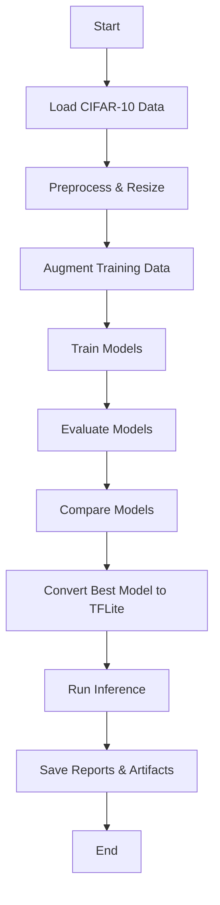

# EdgeVisionNet Architecture Overview

## 1. High-level pipeline

EdgeVisionNet is designed as a modular Edge AI research pipeline with clear separation between data, models, training, evaluation, optimization, and inference.

### Pipeline stages

1. **Data loading and preprocessing**
   - CIFAR-10 dataset loaded via TensorFlow
   - images resized to `224x224`
   - pixel values normalized to `[0, 1]`
   - training dataset shuffling and validation split
2. **Data augmentation**
   - rotation
   - horizontal flip
   - zoom
3. **Model training**
   - baseline MobileNetV2
   - baseline EfficientNet-B0
   - custom EdgeVisionNet with attention
   - early stopping and checkpoint saving
4. **Evaluation**
   - accuracy, precision, recall, F1 score
   - confusion matrix
   - latency and FPS measurement
5. **Model comparison**
   - compare accuracy, latency, and size
   - generate comparison table
6. **Edge optimization**
   - convert best model to TensorFlow Lite
   - optional quantization support
7. **Inference**
   - standard TensorFlow model inference
   - TFLite interpreter inference

## 2. Key project directories

- `models/` — model architectures
- `training/` — dataset pipeline and training logic
- `evaluation/` — metrics, confusion matrix, latency
- `optimization/` — TFLite conversion and optimization helpers
- `inference/` — prediction pipelines for Keras and TFLite
- `utils/` — configuration and logging
- `results/` — graphs, reports, and saved models
- `main.py` — full pipeline orchestration

## 3. Core components

### `utils/config.py`
Defines all pipeline hyperparameters and output paths:
- image size, epochs, batch size
- learning rate
- model list
- directories for results and TFLite output
- quantization settings

### `utils/logger.py`
Provides logging to both console and report file.

### `training/train.py`
Handles:
- CIFAR-10 loading
- preprocessing and resizing
- train/validation/test splits
- augmentation integration
- model training and performance plotting

### `training/augment.py`
Supplies a reusable data augmentation block.

### `training/callbacks.py`
Provides early stopping and checkpoint callbacks.

### `models/mobilenet.py`
Baseline MobileNetV2 model adapted for CIFAR-10.

### `models/efficientnet.py`
Baseline EfficientNet-B0 model adapted for CIFAR-10.

### `models/edgevisionnet.py`
Custom model built on MobileNetV2 with:
- channel attention block
- global average pooling
- dense and dropout head
- softmax classification

### `evaluation/metrics.py`
Computes classification metrics and formats report text.

### `evaluation/confusion_matrix.py`
Plots and saves confusion matrices.

### `evaluation/latency.py`
Measures inference latency and computes FPS.

### `optimization/tflite_converter.py`
Converts a SavedModel to a `.tflite` file, optionally applying quantization.

### `optimization/quantization.py`
Adds representative dataset conversion support for INT8 quantization.

### `optimization/pruning.py`
Provides an optional pruning wrapper using TensorFlow Model Optimization.

### `inference/predict.py`
Performs normal TensorFlow inference on a single image.

### `inference/tflite_inference.py`
Performs TFLite interpreter inference on a single image.

## 4. Execution flow in `main.py`

1. Create result directories
2. Load and prepare CIFAR-10 data
3. For each model:
   - build the model
   - train with augmentation
   - save accuracy plots
   - load best checkpoint
   - save the model artifact
   - evaluate test performance
   - measure latency
   - collect comparison metrics
4. Save the model comparison table and latency report
5. Convert the best model to TFLite
6. Run example TensorFlow and TFLite inference

## 5. Architecture diagram

## 6. Presentation outline

1. **Introduction**
   - Project objective: Edge AI pipeline for CIFAR-10
   - Research goals: model comparison and edge optimization
2. **Dataset and preprocessing**
   - CIFAR-10 overview
   - resizing and normalization
   - train/validation/test split
3. **Model architectures**
   - MobileNetV2 baseline
   - EfficientNet-B0 baseline
   - EdgeVisionNet custom model with attention
4. **Training and augmentation**
   - augmentation techniques used
   - early stopping and checkpointing
5. **Evaluation metrics**
   - accuracy, precision, recall, F1 score
   - confusion matrix analysis
   - latency and FPS ranking
6. **Edge optimization**
   - TFLite conversion
   - optional quantization
7. **Results and comparison**
   - model table
   - best model selection process
8. **Inference deployment**
   - TensorFlow vs TFLite inference
   - artifact generation
9. **Conclusion**
   - key findings
   - future work: dataset persistence, pruning, hardware profiling

## 7. Recommended next steps

- run `python main.py` once the environment is ready
- inspect `results/reports/` and `results/graphs/`
- enable `TFLITE_QUANTIZE = True` for quantization tests
- expand the pipeline to save CIFAR-10 locally in `data/raw/`
- add model pruning and hardware-specific latency profiling
